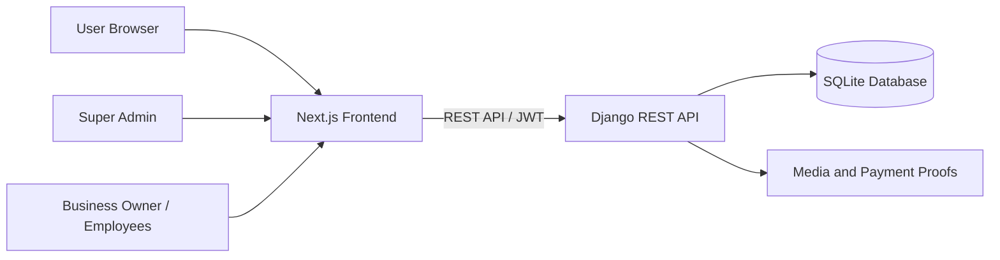

# Smart Business SaaS

A full-stack SaaS-based business management system for small and medium-sized businesses. The platform helps business owners manage subscriptions, employees, products, inventory, sales, customers, due payments, expenses, reports, discounts, and support chat from a single dashboard.

## Overview

Smart Business SaaS provides separate interfaces and permissions for platform administrators, business owners, managers, accountants, and staff members. Each business keeps its own products, stock, sales, customers, expenses, reports, subscription status, and employee records.

The application includes a Django REST API backend and a responsive Next.js frontend.

## Main Features

### Authentication and Access Control

- User registration and login
- JWT access and refresh tokens
- Forgot-password and password-reset flow
- Profile management
- Role-based page and API permissions
- Forced password change for newly created employees

### User Roles

| Role | Main Access |
|---|---|
| `SUPER_ADMIN` | Subscription plans, payment approval, sold subscriptions, platform chat and administration |
| `OWNER` | Full control of the owner's businesses and team members |
| `MANAGER` | Products, inventory, sales, customers, expenses and reports |
| `ACCOUNTANT` | Sales, customer payments, expenses, subscription payments and reports |
| `STAFF` | Daily sales, products and customer-related operations according to assigned permissions |

### Business Management

- Create and update businesses
- Manage multiple businesses from one account
- Business-specific data isolation
- Add employees and assign business roles
- Update existing employee roles

### Subscription System

- Free-trial support
- Monthly, yearly and lifetime packages
- Subscription expiration handling
- Manual payment submission
- Payment-proof upload
- Super Admin approval or rejection
- Package renewal and package change
- Subscription-based feature access
- Sold-subscription records

### Product Management

- Product categories
- Product create, edit, activate and deactivate
- Product SKU
- Size and color variants
- Purchase and selling prices
- Low-stock limit
- Optional initial stock while creating a product
- QR-code label generation and printing
- CSV export

### Inventory Management

- Zero-stock products remain visible on the Stock page
- Stock In
- Stock Out
- Damaged stock
- Returned stock
- Stock adjustments
- Stock transaction history
- Stock transaction vouchers
- Transaction reversal
- Automatic stock updates after sales and cancellations

### Sales and Invoices

- Create multiple-item sales invoices
- Automatic stock reduction
- Customer selection
- Tax calculation
- Voucher and discount calculation
- Percentage and fixed-value vouchers
- Minimum-purchase and maximum-discount rules
- Automatic discounted payable amount
- Full and partial payments
- Due amount calculation
- Reopen due invoices and receive later payments
- Automatic `DUE`, `PARTIAL`, and `PAID` status updates
- Additional payment history
- Printable invoices
- Sale cancellation with stock restoration

### Customer Management

- Add and update customers
- Opening due and current due
- Receive customer payments
- Apply payments against previous due invoices
- Payment receipts
- Customer activity status
- CSV export

### Expense Management

- Expense categories
- Add and update expenses
- Active and inactive expense records
- Expense vouchers
- Search and filtering
- CSV export

### Reports and Dashboard

- Today's sales, expenses and profit
- Monthly sales, expenses and profit
- Total sales and total paid amount
- Sales due and customer due
- Total stock value
- Low-stock products
- Cancelled sales
- Inactive expenses
- Recent sales and expenses
- Business reports and CSV exports

### Chat and Support

- Business Owner to Super Admin chat
- Employee support threads
- Role-aware chat access

## Tech Stack

### Backend

- Python
- Django 5
- Django REST Framework
- Simple JWT
- SQLite for local development
- drf-spectacular / Swagger
- Pillow
- WhiteNoise
- Gunicorn

### Frontend

- Next.js 16 App Router
- React 19
- JavaScript
- Tailwind CSS 4
- Axios
- Lucide React
- React Hot Toast
- QRCode React

## Application Architecture



## Project Structure

```text
smart-business-saas/
├── backend/
│   ├── apps/
│   │   ├── accounts/
│   │   ├── auditlog/
│   │   ├── businesses/
│   │   ├── chat/
│   │   ├── customers/
│   │   ├── expenses/
│   │   ├── inventory/
│   │   ├── payments/
│   │   ├── products/
│   │   ├── reports/
│   │   ├── sales/
│   │   └── subscriptions/
│   ├── config/
│   ├── manage.py
│   ├── requirements.txt
│   └── .env.example
├── frontend/
│   ├── app/
│   ├── components/
│   ├── context/
│   ├── lib/
│   ├── public/
│   ├── package.json
│   └── .env.example
├── .gitignore
└── README.md
```
-admin@gmail.com
admin12345
## Prerequisites

Install the following software before running the project:

- Python 3.11 or newer
- Node.js 20 or newer
- npm
- Git

## Local Installation

Clone the repository:

```bash
git clone <your-repository-url>
cd smart-business-saas
```

### Backend Setup

Open a terminal in the project root:

```powershell
cd backend
python -m venv venv
venv\Scripts\activate
copy .env.example .env
python -m pip install --upgrade pip
python -m pip install -r requirements.txt
python manage.py migrate
python manage.py createsuperuser
python manage.py runserver
```

For macOS or Linux, activate the virtual environment with:

```bash
source venv/bin/activate
```

The backend server will run at:

```text
http://127.0.0.1:8000
```

The Django Admin panel will be available at:

```text
http://127.0.0.1:8000/admin/
```

Swagger API documentation will be available at:

```text
http://127.0.0.1:8000/api/docs/
```

### Frontend Setup

Open a second terminal:

```powershell
cd frontend
copy .env.example .env.local
npm ci
npm run dev
```

The frontend will run at:

```text
http://localhost:3000
```

## Environment Variables

### Backend `.env`

Create `backend/.env` from `backend/.env.example`:

```env
SECRET_KEY=replace-with-a-long-random-secret-key
DEBUG=True
ALLOWED_HOSTS=127.0.0.1,localhost
```

### Frontend `.env.local`

Create `frontend/.env.local` from `frontend/.env.example`:

```env
NEXT_PUBLIC_API_BASE_URL=http://127.0.0.1:8000/api
```

Never commit real secrets, passwords, private keys, payment proofs, production environment files, or local databases to GitHub.

## Running the Project Later

### Backend

```powershell
cd backend
venv\Scripts\activate
python manage.py runserver
```

### Frontend

```powershell
cd frontend
npm run dev
```

Keep both terminals running while using the application.

## Testing and Validation

Run backend checks and tests:

```powershell
cd backend
venv\Scripts\activate
python manage.py check
python manage.py test
```

Run frontend linting and production build:

```powershell
cd frontend
npm run lint
npm run build
```

## Basic Usage Flow

1. Register a user account.
2. Create a business and activate the free trial or select a subscription package.
3. Add employees and assign roles.
4. Create categories and products.
5. Add initial stock or use the Stock page to add stock.
6. Create customers when necessary.
7. Create sales and apply vouchers, tax, paid amount or due amount.
8. Reopen due invoices later to receive additional payments.
9. Record expenses and review business reports.
10. Use the Super Admin account to approve subscription payments and provide chat support.

## Important Routes

| Page | Route |
|---|---|
| Login | `/login` |
| Register | `/register` |
| Dashboard | `/dashboard` |
| Business | `/business` |
| Employees | `/employees` |
| Products | `/products` |
| Stock | `/stock` |
| Sales | `/sales` |
| Customers | `/customers` |
| Expenses | `/expenses` |
| Payments | `/payments` |
| Reports | `/reports` |
| Discounts | `/discounts` |
| Chat | `/chat` |
| Super Admin Payments | `/admin/payments` |
| Subscription Plans | `/admin/subscription-plans` |

## GitHub Upload Notes

The included `.gitignore` excludes common local and private files, including:

```text
backend/venv/
backend/db.sqlite3
frontend/node_modules/
frontend/.next/
backend/.env
frontend/.env.local
media/
*.log
```

Before pushing, confirm that none of these files are staged:

```bash
git status
```

## Production Notes

The current configuration is suitable for local development. Before a production deployment, configure:

- PostgreSQL or another production database
- `DEBUG=False`
- Secure environment variables
- Production `ALLOWED_HOSTS`
- CORS and CSRF trusted origins
- HTTPS and domain configuration
- Static and media storage
- Email provider
- Database and media backups
- Secure Super Admin credentials

## Developer

**MD.Mahamodul Hasan Taj**  
Computer Science and Engineering  
Software Engineering Project
_mhtaj655@gmail.com


---

This repository is intended for educational, portfolio, and business-management system development purposes.
